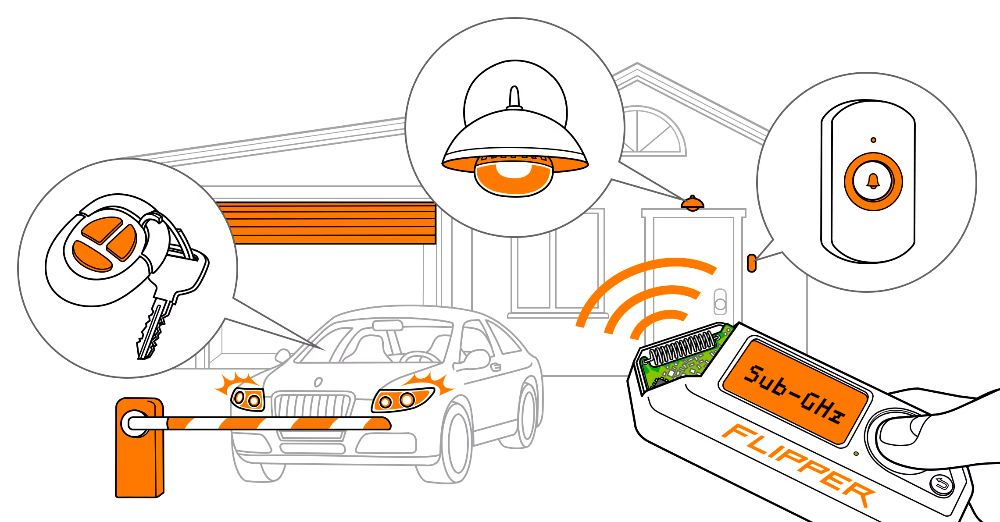
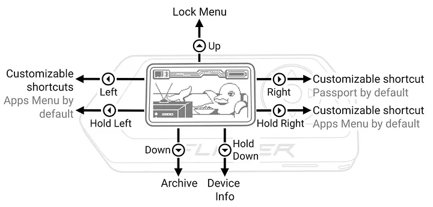

# Description

The Flipper Zero is a multifunctional security and hacking tool designed for various tasks related to cybersecurity and electronics.

<figure><figcaption></figcaption></figure>

It features a built-in radio module, infrared transmitter, NFC module, and more, making it a versatile device for penetration testing, signal analysis, and hardware hacking.&#x20;

With its compact size and diverse capabilities, the Flipper Zero is well-suited for professionals in the cybersecurity field, offering a range of tools for assessing and securing different types of networks and systems.&#x20;

If you have specific questions or need more detailed information about certain aspects of the Flipper Zero, feel free to ask.

<figure><figcaption></figcaption></figure>

### Flipper Zero  Attacks

The Flipper Zero is a versatile device designed for various security-related tasks, including penetration testing and ethical hacking. It comes with a range of features and capabilities that allow cybersecurity professionals to assess and secure different types of systems.&#x20;

Some of the attacks and security assessments that Flipper Zero can be involved in include:

#### **RFID/NFC Attacks**

Flipper Zero can be used to perform security assessments on RFID and NFC systems, such as cloning RFID cards, sniffing NFC communications, and analyzing vulnerabilities in these technologies.

#### **Infrared Attacks**

The device is equipped with an infrared transmitter/receiver, enabling it to interact with and potentially exploit vulnerabilities in infrared communication systems.

#### **Wireless Attacks**

Flipper Zero may support wireless communication protocols, allowing professionals to assess the security of wireless networks, including Wi-Fi and Bluetooth.

#### **Hardware Hacking**

With its capabilities for hardware interaction, the Flipper Zero can be used in hardware hacking scenarios, such as analyzing and manipulating embedded systems.

#### **Password Cracking**

The device may support password-cracking techniques for various systems, such as brute force attacks or other password exploitation methods.

#### **Social Engineering**

While not a direct attack, Flipper Zero can aid professionals in conducting security assessments that involve social engineering, such as testing the susceptibility of employees to phishing attacks.

#### **Signal Analysis**

Flipper Zero's radio module allows for signal analysis, enabling professionals to identify and analyze various signals within a given frequency range.

It's important to note that the use of such tools and conducting security assessments should be done ethically and legally.&#x20;

<figure><figcaption></figcaption></figure>

Professionals using Flipper Zero or similar devices should have proper authorization and follow ethical guidelines to avoid legal issues.
