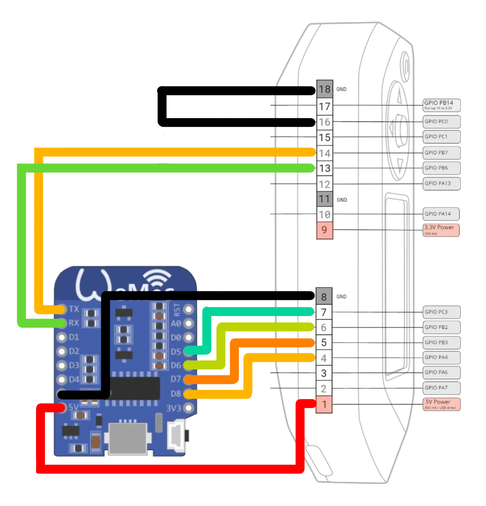

# ESP8266

Connecting a Flipper Zero to an ESP8266 can be done in a few ways, depending on your desired functionality and the specific modules you're using. Here's a breakdown of the different approaches:

**1. External ESP8266 Module:**

This involves connecting a pre-built ESP8266 module, like the "Wi-Fi Scanner" module by Sequoia San, to Flipper Zero's GPIO pins. This allows you to leverage the ESP8266's Wi-Fi capabilities for various applications like enhanced Wi-Fi scanning, de-authentication attacks (ethical testing only!), and custom projects.

**Here's what you'll need:**

* Flipper Zero
* External ESP8266 module with appropriate firmware (check the module's documentation)
* Jumper wires

**Steps:**

1. **Wiring:** Connect the ESP8266 module's pins to the corresponding Flipper Zero GPIO pins based on the module's documentation. Typically, this involves connecting power (3.3V and GND), SPI communication (SCLK, MISO, MOSI), and optionally reset and chip select pins.
2. **Power on:** Power both the Flipper Zero and the ESP8266 module.
3. **Flipper Zero App:** Open the relevant application on the Flipper Zero that works with the connected ESP8266 module, like "Wi-Fi Scanner" or "DEAUTH Attack" (for ethical testing only!).

**2. ESP8266 as Flipper Zero Submodule:**

This approach involves flashing your own custom firmware onto an ESP8266 module and turning it into a submodule for the Flipper Zero. This offers more flexibility in terms of functionality but requires programming knowledge and specific firmware development.

**Here's what you'll need:**

* Flipper Zero
* ESP8266 module with suitable development board and tools
* Programming knowledge and experience
* Custom Flipper Zero submodule firmware for ESP8266

**Steps:**

1. **Develop and flash firmware:** Develop your custom firmware for the ESP8266 that interacts with the Flipper Zero using its submodule API. Flash the firmware onto the ESP8266 module.
2. **Connect to Flipper Zero:** Connect the ESP8266 module to Flipper Zero's GPIO pins following the submodule communication protocol guidelines.
3. **Flipper Zero App:** The Flipper Zero should automatically recognize the connected submodule and allow you to interact with it through the appropriate app or interface.

**Resources:**

* Flipper Zero Documentation: [https://docs.flipper.net/](https://docs.flipper.net/)
* Flipper Zero Submodules: [https://docs.flipper.net/](https://docs.flipper.net/)
* Flipper Zero Wi-Fi Scanner Module: [https://github.com/Timmotools/flipperzero\_esp8266\_deautherv2](https://github.com/Timmotools/flipperzero\_esp8266\_deautherv2)
* Flipper Zero to ESP8266 connection wiring video: [https://www.youtube.com/watch?v=ESo9QrBFD7M](https://www.youtube.com/watch?v=ESo9QrBFD7M)

### Web Install





<figure><figcaption></figcaption></figure>
