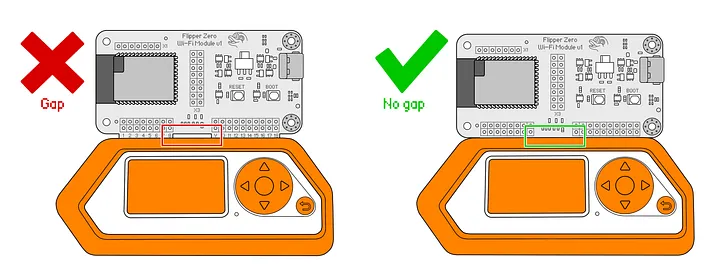
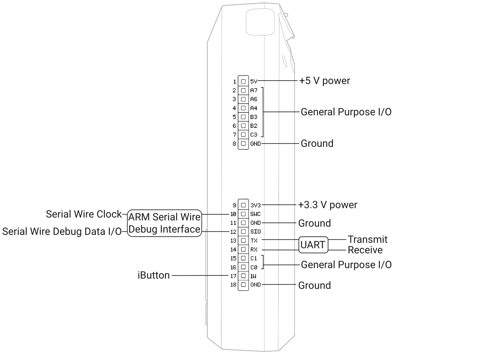

# 🟢 GPIO

The Flipper Zero GPIO stands for General Purpose Input/Output and consists of 18 pins on the top side of the device. These pins allow you to interact with various electronic components and modules, making them a powerful tool for tinkering, learning, and even professional applications.

<figure><figcaption></figcaption></figure>

### **Types of pins**

* **Power supply pins:** Provide power to external modules (3.3V and 5V).
* **I/O pins:** These are the main workhorses, allowing input (reading data) and output (sending data) to various components.

<figure><figcaption></figcaption></figure>

### **Individual GPIO Pins for UART Communication**

Specific GPIO pins can be configured to function as TX and RX for custom UART communication.

* Requires programming knowledge and configuration through the Flipper Zero's interface.
* Use GPIO Pin 14 (RX) and Pin 13 (TX) for default UART functionality.
* Other pins (2, 3, 4, 5, 6, 7, 15, 16) can be configured for UART with additional setup.
* Allows flexibility for interfacing with various devices and protocols.

### More Documentation

* Flipper Zero GPIO & Modules documentation: [https://docs.flipper.net/gpio-and-modules](https://docs.flipper.net/gpio-and-modules)
* Flipper Zero tutorials and projects: [https://github.com/flipperdevices/flipperzero-firmware](https://github.com/flipperdevices/flipperzero-firmware)
