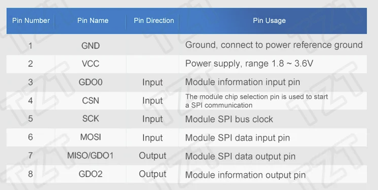

# CC1101

<figure><figcaption></figcaption></figure>

<figure><figcaption></figcaption></figure>

<figure><figcaption></figcaption></figure>

<figure><figcaption></figcaption></figure>

| Flipper Zero | СС1101 |
| ------------ | :----: |
| 2            |  MOSI  |
| 3            |  MISO  |
| 4            |   CS   |
| 5            |   SCK  |
| 6            |   GD0  |
| 9            |   VCC  |
| 11           |   GND  |
