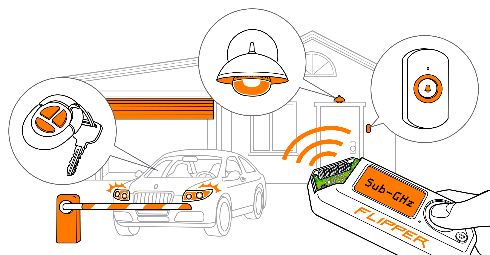

# Sub-Ghz Bruteforcer

<figure><figcaption></figcaption></figure>

| Princeton\_433 (works with the majority of static code systems) | 433.92 | Static  |
| --------------------------------------------------------------- | ------ | ------- |
| Nice Flo 12bit\_433                                             | 433.92 | Static  |
| Nice Flo 24bit\_433                                             | 433.92 | Static  |
| CAME 12bit\_433                                                 | 433.92 | Static  |
| CAME 24bit\_433                                                 | 433.92 | Static  |
| Linear\_300                                                     | 300.00 | Static  |
| CAME TWEE                                                       | 433.92 | Static  |
| Gate TX\_433                                                    | 433.92 | Static  |
| DoorHan\_315                                                    | 315.00 | Dynamic |
| DoorHan\_433                                                    | 433.92 | Dynamic |
| LiftMaster\_315                                                 | 315.00 | Dynamic |
| LiftMaster\_390                                                 | 390.00 | Dynamic |
| Security+2.0\_310                                               | 310.00 | Dynamic |
| Security+2.0\_315                                               | 315.00 | Dynamic |
| Security+2.0\_390                                               | 390.00 | Dynamic |

### Supported Sub-GHz vendors

Check the list at [https://docs.flipperzero.one/sub-ghz/supported-vendors](https://docs.flipperzero.one/sub-ghz/supported-vendors)

### Supported Frequencies by region

Check the list at [https://docs.flipperzero.one/sub-ghz/frequencies](https://docs.flipperzero.one/sub-ghz/frequencies)

### CAME 12bit 303 Mhz

CAME 12bit 303 MHz refers to a less common frequency and coding scheme used in some CAME remote controls for operating gates, barriers, and other automation systems.

### CAME 12bit 307 Mhz

### CAME 12bit 315 Mhz

### CAME 12bit 433 Mhz

CAME 12bit 433 MHz refers to another specific frequency and coding scheme used in CAME remote controls, similar to the 868 MHz version you mentioned previously.

### CAME 12bit 868 Mhz

**Applications:** CAME 12bit 868 MHz remotes are used with various CAME automation systems, including:

* Gate automation systems
* Barrier systems
* Garage door openers
* Lighting control systems
* Alarm systems

### Security+2.0\_390

Security+2.0\_390 is a specific protocol used in some garage door opener remotes, particularly those manufactured by LiftMaster. It operates on a frequency of 390 MHz and utilizes a more secure rolling code mechanism compared to older protocols like Security+ 1.0.

[https://docs.flipper.net/sub-ghz](https://docs.flipper.net/sub-ghz)\
[https://github.com/tobiabocchi/flipperzero-bruteforce](https://github.com/tobiabocchi/flipperzero-bruteforce)
