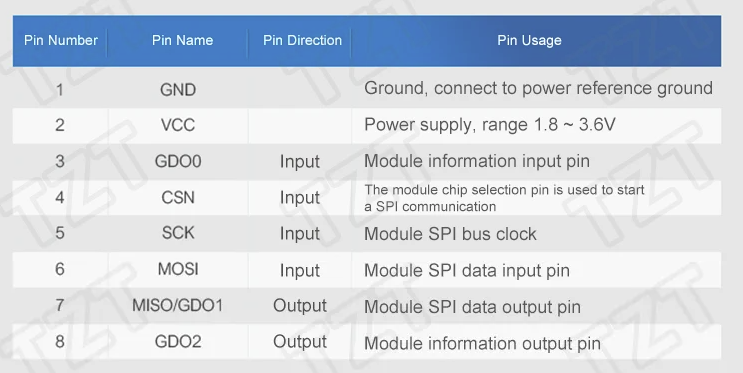

# CC1101

<figure><figcaption></figcaption></figure>

<figure><figcaption></figcaption></figure>

<figure><figcaption></figcaption></figure>

<figure><figcaption></figcaption></figure>

| Flipper Zero | СС1101 |
| ------------ | :----: |
| 2            |  MOSI  |
| 3            |  MISO  |
| 4            |   CS   |
| 5            |   SCK  |
| 6            |   GD0  |
| 9            |   VCC  |
| 11           |   GND  |

### How to extend SubGHz supported frequency range

**CC1101 Frequency range specs: 300-348 MHz, 386-464 MHz, and 778-928 MHz (+ 350MHz and 467MHz was added to default range)**

**This setting will extend to: 281-361 MHz, 378-481 MHz, and 749-962 MHz**

1. Please do not do that unless you know what exactly you are doing
2. You don't need extended range for almost all use cases
3. Extending frequency range and transmitting on frequencies that outside of hardware specs can damage your hardware!
4. Flipper Devices team and/or unleashed/RogueMaster fw developers are not responsible of any damage that can be caused by using CFW or extending frequency ranges!!!

If you really sure you need that change, find `subghz/assets/extend_range.txt` file on your microSD, read comments on first lines and change `false` to `true`
